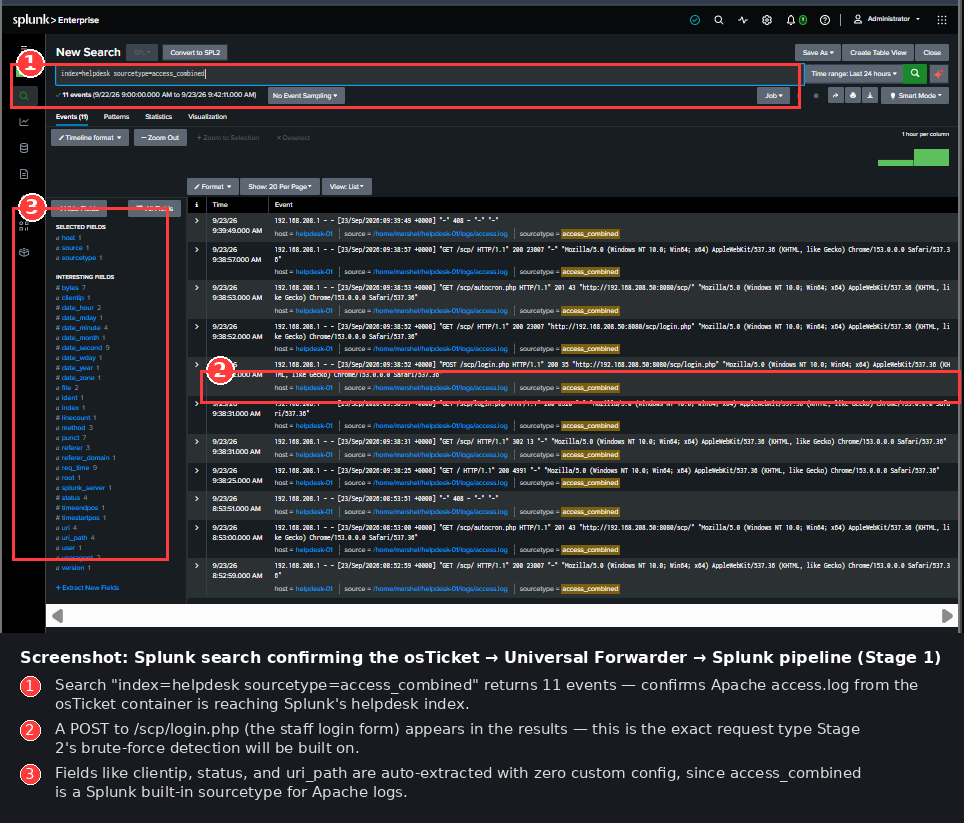

# Project 4: SOC Help Desk Intake & Triage System — Stage 1


## What this project is

Every SOC and GRC team runs on a ticketing system. Alerts, phishing reports, and access requests all have to go *somewhere* before an analyst can triage them. Most security portfolios skip this entirely and jump straight to "I found the bad thing" — but in a real job, you also need to know how a report becomes a ticket, gets prioritized, and gets tracked to resolution.

This project builds that intake layer: a self-hosted help desk system (osTicket), containerized with Docker, with its logs shipped into the same Splunk SIEM I built in an earlier project. Stage 1 (this write-up) covers standing up the system and proving the log pipeline works end to end. Stage 2 (next session) builds an actual brute-force login detection on top of it, mapped to MITRE ATT&CK.

## Why this matters for a SOC/GRC role

- Shows I can containerize and run a real application securely, not just follow a checklist
- Shows I understand the *workflow* side of security work — alert intake and triage — not only detection
- Reuses and reinforces skills from earlier projects (VM builds, Splunk forwarding, log parsing) rather than treating each project as a one-off

## Architecture

```
                    Host-only lab network (192.168.208.0/24)
┌──────────────────────┐        ┌──────────────────────┐
│   helpdesk-01         │        │   splunk-siem-01      │
│   192.168.208.50      │        │   192.168.208.40      │
│                        │        │                        │
│  ┌──────────────────┐  │        │  Splunk Enterprise     │
│  │ Docker            │  │        │  (already built in an │
│  │  ┌──────────────┐  │  │  logs  │   earlier project)    │
│  │  │ osTicket      │──┼──┼───────▶│                        │
│  │  │ (Apache+PHP)  │  │  │ :9997  │  index = helpdesk      │
│  │  └──────┬───────┘  │  │        │                        │
│  │         │           │  │        └──────────────────────┘
│  │  ┌──────▼───────┐  │  │
│  │  │ MariaDB       │  │  │
│  │  │ (DB only —    │  │  │
│  │  │  not exposed) │  │  │
│  │  └──────────────┘  │  │
│  └──────────────────┘  │
│                        │
│  Universal Forwarder    │
│  reads Apache's         │
│  access.log and ships   │
│  it out over 9997       │
└──────────────────────┘
```

## What I built, step by step

### 1. VM and networking
Stood up a new Ubuntu Server 26.04 VM (`helpdesk-01`) in VirtualBox, on the same host-only lab network as my other projects (`192.168.208.50`), plus a NAT adapter for internet access and SSH. Set the static IP with netplan and confirmed connectivity by pinging my existing apache-web-01 and splunk-siem-01 VMs — 0% packet loss both ways.

### 2. Docker
Installed Docker Engine and Docker Compose from Docker's official repository (not Ubuntu's older bundled version). Docker Compose lets me define multiple containers — the app and its database — in one file and bring them up together, already networked to talk to each other.

### 3. Getting osTicket actually running (the hard part)
This is where most of the real troubleshooting happened, and it's worth documenting because working through it is the actual skill being demonstrated, not just typing commands that worked on the first try.

- **First image failed outright.** The official-looking `osticket/osticket` Docker image threw a PHP syntax error from inside its own bundled code — a compatibility break between old osTicket source and a newer PHP version the image had pulled in. Not something fixable from my side; the image itself was broken.
- **Switched images.** Found and moved to `rinkp/osticket-dockerized`, an actively maintained image built specifically for automated, environment-variable-driven installs.
- **Password mismatch #1.** After the switch, the database rejected the app's connection. Root cause: Docker's MariaDB image only runs its "create the database and user" setup the *first* time it starts against an empty data volume. Since I'd reused a volume from the failed first attempt, my new password never actually got applied. Fixed by wiping the volume (`docker compose down -v`) and letting it initialize fresh.
- **Password mismatch #2.** Even after that fix, the database still rejected the connection — this time because I'd left a literal placeholder value (`<your-password>`) in the config instead of replacing it with a real password. Easy mistake, real lesson: always verify what's actually in a config file rather than assuming an edit took.
- **Fix for good.** Rather than keep hand-typing the same password into two different places (which is how both of the above happened), I moved every credential into a single `.env` file that both the database and app config now reference. They physically cannot drift out of sync anymore, because they both read from the same source.

**Result:** osTicket installed cleanly. Both interfaces confirmed working:
- Staff control panel (agent/admin login) at `http://192.168.208.50:8080/scp`
- Public customer-facing ticket portal at `http://192.168.208.50:8080`

### 4. Basic hardening
- Confirmed MariaDB is **not** reachable from the host or the lab network at all — only osTicket's own container can talk to it, over Docker's internal network. Verified two ways: nothing listening on port 3306 on the host itself, and a direct connection test from my Windows machine to the VM's IP on port 3306 failed as expected.
- Only port 8080 (the web app) is exposed externally — everything else stays internal to Docker.
- Rotated my admin password after accidentally exposing an earlier one in my own notes during debugging — a good reminder that credentials typed into logs, chat, or scratch files should be treated as burned and replaced, not reused.

### 5. Log pipeline to Splunk
Since osTicket runs in a container, its logs don't live in a normal host filesystem path by default. I mounted the container's Apache log directory out to the host (`/var/log/apache2` → a `logs/` folder in my project directory) so a Splunk Universal Forwarder running on the VM itself can read it.

Installed the Universal Forwarder, pointed it at my existing Splunk indexer (`splunk-siem-01:9997`), created a new dedicated index called `helpdesk` (keeping this project's data separate from my other projects' indexes), and configured it to monitor the access log using Splunk's built-in `access_combined` sourcetype — which automatically parses out fields like source IP, HTTP status, and the requested URL path with no extra configuration needed.

**Troubleshooting along the way:**
- The Universal Forwarder's initial admin account silently failed to create because the seed password was too short — Splunk enforces a minimum length but doesn't always error clearly when the seed fails. Fixed by using a longer password and restarting.
- Separately, the Splunk indexer's own admin account had a password I'd lost track of. Reset it by removing its user database and reseeding — a useful thing to know how to do rather than treat as a dead end.

### 6. Validating the pipeline

Reloaded the osTicket login page a few times to generate traffic, then confirmed:
- The events appeared immediately in the raw log file on the VM
- The same events landed in Splunk's `helpdesk` index within seconds, fully parsed



As the screenshot shows: searching `index=helpdesk sourcetype=access_combined` returns real events, including a `POST` request to `/scp/login.php` — the staff login form. That specific request type is the foundation for the brute-force detection I'll build in Stage 2.

## What's next (Stage 2)

- Simulate a brute-force attack against the staff login from my Kali VM
- Build a detection search in Splunk that flags repeated login attempts from a single source in a short time window
- Map the detection to MITRE ATT&CK T1110 (Brute Force), consistent with the framing used in my other detections
- Save it as a working alert, not just a one-off search

## Skills demonstrated in this stage

`Docker & Docker Compose` · `Linux VM administration` · `network segmentation` · `troubleshooting real deployment failures` · `credential hygiene` · `Splunk Universal Forwarder configuration` · `log source identification and parsing` · `documentation`